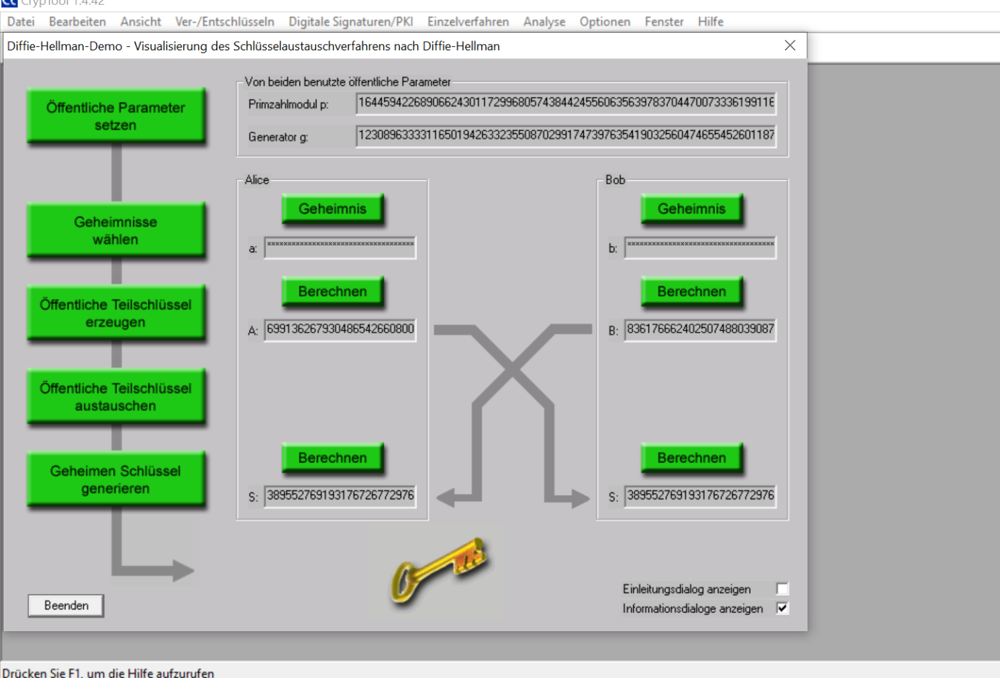

<!-- omit in toc -->
# Modul 114

## Inhaltsverzeichnis

- [Inhaltsverzeichnis](#inhaltsverzeichnis)
- [Themenbereiche](#themenbereiche)
  - [Daten codieren](#daten-codieren)
    - [A.1 Zahlensysteme, numerische Codes](#a1-zahlensysteme-numerische-codes)
      - [Aufgabe zu Notepad++ und HxD](#aufgabe-zu-notepad-und-hxd)
    - [A.2 Alphanumerische Codes ASCII und Unicode](#a2-alphanumerische-codes-ascii-und-unicode)
    - [A.3 Zusammengesetzte Codierung, Barcodes](#a3-zusammengesetzte-codierung-barcodes)
    - [A.4 Bildcodierung](#a4-bildcodierung)
      - [RGB](#rgb)
      - [CMYK](#cmyk)
      - [YbcCr](#ybccr)
  - [Daten komprimieren](#daten-komprimieren)
    - [B.1 Verlustlose Komprimierung](#b1-verlustlose-komprimierung)
    - [B.2 Verlustbehaftete Komprimierung](#b2-verlustbehaftete-komprimierung)
  - [Grundlagen Kryptografien](#grundlagen-kryptografien)
    - [C.1 Symmetrische Verschlüsselung](#c1-symmetrische-verschlüsselung)
    - [C.2 Asymmetrische Verschlüsselung](#c2-asymmetrische-verschlüsselung)
    - [C.3 Digital signieren](#c3-digital-signieren)
  - [Gesicherte Datenübertragung](#gesicherte-datenübertragung)
    - [D.1 Public Key Infrastruktur](#d1-public-key-infrastruktur)
    - [D.2 Internet und Zertifikate](#d2-internet-und-zertifikate)
    - [D.3 PGP und OpenPGP](#d3-pgp-und-openpgp)
    - [D.4 Sichere E-Mails](#d4-sichere-e-mails)
- [Reflexion](#reflexion)
  - [Tag 1 (16.05.2023)](#tag-1-16052023)
  - [Tag 2 (23.05.2023)](#tag-2-23052023)
  - [Tag 3 (30.05.2023)](#tag-3-30052023)
  - [Tag 4 (06.06.2023)](#tag-4-06062023)
  - [Tag 5 (13.06.2023)](#tag-5-13062023)
  - [Tag 6 (20.06.2023)](#tag-6-20062023)
  - [Tag 7 (27.06.2023)](#tag-7-27062023)

## Themenbereiche

### Daten codieren

#### A.1 Zahlensysteme, numerische Codes

1. Ergänzen sie die folgende BIN-DEC-HEX-Zahlentabelle: (Was bedeutet MSB bzw. LSB?)

    - MSB: Most Significant Bit
    - LSB: Least Significant Bit

    |BIN(MSB)|BIN|BIN|BIN(LSB)|DEC|HEX|
    |:---|:---|:---|:---|---:|---:|
    | 0 | 0 | 0 | 0 | 0 | 0 |
    | 0 | 0 | 0 | 1 | 1 | 1 |
    | 0 | 0 | 1 | 0 | 2 | 2 |
    | 0 | 0 | 1 | 1 | 3 | 3 |
    | 0 | 1 | 0 | 0 | 4 | 4 |
    | 0 | 1 | 0 | 1 | 5 | 5 |
    | ... | ... | ... | ... | ... | ... |
    | 1 | 1 | 1 | 1 | 15 | F |

2. Wandeln sie die folgende Dezimalzahl ohne Taschenrechner in die entsprechende Binärzahl um: 911

   - 1110001111

3. Wandeln sie die folgende Binärzahl ohne Taschenrechner in die entsprechende Dezimalzahl um: 1011'0110

   - 182

4. Wandeln sie die folgende Binärzahl ohne Taschenrechner in die entsprechende Hexadezimalzahl um: 1110'0010'1010'0101

   - 58021

##### Aufgabe zu Notepad++ und HxD

`switzerland.bin` hat folgenden Inhalt:

```bin
°Eö
```

Das ist in HEX

```h
05 0B A1 45 12 1A 1F 9A
```

Folgende Zahlen lassen sich daraus extrahieren:

- `05 0B` -> `1291`: Bundesbrief der Schweiz
- `A1 45` -> `41285`: Fläche der Schweiz in km²
- `12 1A` -> `4643`: Dufourspitze
- `1F 9A` -> `8090`: PLZ der Behörden und Schulen in Zürich

#### A.2 Alphanumerische Codes ASCII und Unicode

- Welche der Dateien ist nun ASCII-codiert, welche UTF-8 und welche UTF-16 BE-BOM?

  - `Textsample1`: `ASCII`
  - `Textsample2`: `UTF-8`
  - `Textsample3`: `UTF-16 BE`

- Alle drei Dateien enthalten denselben Text. Aus wie vielen Zeichen besteht dieser?

  - 68

- Was sind die jeweiligen Dateigrössen? (Beachten sie, dass unter Grösse auf Datenträger jeweils 0 Bytes angegeben wird. Dies darum, weil beim Windows-Dateisystem NTFS kleine Dateien direkt in die MFT (Master File Table) geschrieben werden.) Wie erklären sie sich die Unterschiede?

  - Da ich ein UNIX-Basiertes Betriebssystem habe (MacOS), kann ich dies nicht beurteilen.

- Bei den weiteren Fragen interessieren uns nur noch die ASCII- und die UTF-8-Datei: Bekanntlich ist UTF-8 in den ersten 128 Zeichen deckungsgleich mit ASCII. Untersuchen sie nun die beiden HEX-Dumps und geben sie an, welche Zeichen unterschiedlich codiert sind. Ein kleiner Tipp: Es sind deren zwei.

  - `€` und `ä`

- Was bedeuten die beiden Ausdrücke, denen wir z.B. bei UTF-16 begegnen: Big-Endian (BE), Little-Endian (LE)?

  - Big-Endian (BE): Das höchstwertige Byte wird zuerst geschrieben.
  - Little-Endian (LE): Das niederstwertige Byte wird zuerst geschrieben.

- Im Notepad++ kann man unter dem Menüpunkt Codierung von ASCII zu UTF umschalten. Spielen sie damit etwas herum und notieren sie sich, was in der Darstellung jeweils ändert.

  - Je nach Kodierung ändern sich die Sonderzeichen, weil die Zeichentabellen anders interpretiert werden.

- Für Anspruchsvolle: Der UTF-8-Code kann je nach Zeichen ein, zwei, drei oder vier Byte lang sein. Wie kann der Textreader erkennen, wann ein UTF-8 Zeichencode beginnt und wann er endet? Untersuchen sie dies anhand der beiden Textsamples und lesen sie in z.B. Wikipedia die entsprechende Theorie zu UTF-8 durch. Tipp: Startbyte und Folgebyte.

#### A.3 Zusammengesetzte Codierung, Barcodes

> Keine Aufgaben thematisiert.

#### A.4 Bildcodierung

##### RGB

- `#FF0000` entspricht der Farbe -> rot
- `#00FF00` entspricht der Farbe -> grün
- `#0000FF` entspricht der Farbe -> blau
- `#FFFF00` entspricht der Farbe -> gelb
- `#00FFFF` entspricht der Farbe -> cyan
- `#FF00FF` entspricht der Farbe -> magenta
- `#000000` entspricht der Farbe -> schwarz
- `#FFFFFF` entspricht der Farbe -> weiss
- `#00BC00` entspricht der Farbe -> dunkel-grün

##### CMYK

- C:0%, M:100%, Y:100%, K:0%    entspricht der Farbe -> rot
- C:100%, M:0%, Y:100%, K:0%    entspricht der Farbe -> grün
- C:100%, M:100%, Y:0%, K:0%    entspricht der Farbe -> blau
- C:0%, M:0%, Y:100%, K:0%      entspricht der Farbe -> gelb
- C:100%, M:0%, Y:0%, K:0%      entspricht der Farbe -> cyan
- C:0%, M:100%, Y:0%, K:0%      entspricht der Farbe -> magenta
- C:100%, M:100%, Y:100%, K:0%  entspricht der Farbe -> schwarz (in theorie)
- C:0%, M:0%, Y:0%, K:100%      entspricht der Farbe -> schwarz
- C:0%, M:0%, Y:0%, K:0%        entspricht der Farbe -> weiss
- C:0%, M:46%, Y:38%, K:22%     entspricht der Farbe -> dunkeleres rot

##### YbcCr

- RGB 255/255/255           ergibt in YCbCr      -> 1, 0, 0
- RGB 0/0/0                 ergibt in YCbCr      -> 0, 0, 0
- Y:1, Cb:0, Cr:0           entspricht der Farbe -> weiss
- Y:0, Cb:0, Cr:0           entspricht der Farbe -> schwarz
- Y:0, Cb:1, Cr:0           entspricht der Farbe -> rot
- Y:0, Cb:-1, Cr:0          entspricht der Farbe -> grün
- Y:0, Cb:0, Cr:1           entspricht der Farbe -> blau
- Y:0, Cb:0, Cr:-1          entspricht der Farbe -> dunkel grün
- Y:0.3, Cb:0.5, Cr:-0.17   entspricht der Farbe -> rot(/braun, bäsch?)

### Daten komprimieren

#### B.1 Verlustlose Komprimierung

1. **Huffman-Algorithmus:** (Teamarbeit). Jeder denkt für sich ein Wort mit ca. 15 Buchstaben aus und erstellt dazu die Huffman-Codetabelle und das entsprechend komprimierte Wort in HEX-Darstellung. Nun werden die Codes inklusive der Codetabelle gegenseitig ausgetauscht. Kann ihr Partner ihr gewähltes Wort richtig dekomprimieren?

   - Mein Wort ist BANANENKUCHEN:

    ```huffmann
    B A N E K U C H
    1 2 4 2 1 1 1 1
    ```

2. **RLC/E-Verfahren:** Sie erhalten diesen RL-Code:
  Folgendes ist ihnen dazu bekannt: Es handelt sich um eine quadratische Schwarz-Weiss-Rastergrafik mit einer Kantenlänge von 8 Pixel. Es wird links oben mit der Farbe Weiss begonnen. Eine Farbe kann sich nicht mehr als siebenmal wiederholen. Zeichnen sie die Grafik auf. Was stellt sie dar?

  010 100 011 110 010 010 010 010 010 010 010 010 010 110 010 110 010 010 010 010 010 010 010 010 001

  Das entspricht:

  ```binary
  010 2 100 4 011 3 110 6

  010 2 010 2 010 2 010 2

  010 2 010 2 010 2 010 2

  010 2 110 6

  010 2 110 6

  010 2 010 2 010 2 010 2

  010 2 010 2 010 2 010 2

  001 1
  ```

  Als Bild:

  0 0|1 1 1 1|0 0 0|1 1 1 1 1 1|0 0|1 1|0 0|1 1|0 0|1 1|0 0|1 1|0 0|1 1 1 1 1 1|0 0|1 1 1 1 1 1|0 0|1 1|0 0|1 1|0 0|1 1|0 0|1 1|0

  
  
3. **LZW-Verfahren:** Erstellen sie die LZW-Codierung für das Wort «ANANAS» und überprüfen sie mit der Dekodierung ihr Resultat. Danach versuchen sie den erhaltenen LZW-Code «ERDBE<256>KL<260>» zu dekomprimieren.

  ANANAS
  AN<256>AS

  ERDBE<256>KL<260> = ERDBEERKLEE

4. **ZIP-Komprimierung:** Wir wollen die Effizienz bei der ZIP-Komprimierung untersuchen. Dazu sollen sie ASCII-Textdateien erstellen.
  Die erste enthält 10, die zweite 100, die dritte 1000, die vierte 10'000 und die fünfte 100'000 ASCII-Zeichen. Achten sie darauf, dass die Zeichen möglichst zufällig gewählt werden. Auf dem Internet findet man entsprechende Textgeneratoren. Kopieren sie jede dieser fünf Textdateien in eine eigene ZIP-Datei. In der Folge erhalten sie fünf ZIP-Dateien. Werten sie nun in einer EXCEL-Tabelle die erforderlichen Speichergrössen aus: ASCII-Datei-Grösse zu ZIP-Datei-Grösse. Versuchen sie nun, ihr Resultat zu interpretieren bzw. zu begründen. Tipp: Sie können in EXCEL Zahlenreihen auch grafisch anzeigen.
  Nun legen wir noch einen drauf: Erstellen sie eine ASCII-Textdatei mit 100'000 Zeichen. Diemal aber nicht random-befüllt, sondern ausschliesslich mit dem Buchstaben A, danach zippen sie. Vergleichen sie nun die beiden ZIP-Dateien. Wie erklären sie sich den Unterschied der Speichergrössen?
  Zu guter letzt wollen wir untersuchen, was die ZIP-Komprimierung bringt, wenn die Originaldatei, wie beim JPG-Bildformat, bereits komprimiert (DCT) vorliegt. Dazu erhalten sie die zwei folgenden Bilder:
  [ZIPTestHi.jpg](/GITressourcen/Daten_komprimieren/ZIPTestHi.jpg) und
  [ZIPTestLo.jpg](/GITressourcen/Daten_komprimieren/ZIPTestLo.jpg)
  Gehen sie nun gleich vor, wie beim vorangegangenen Untersuch der Textdateien. Begründen sie ihr Resultat.

5. **BWT (Burrows-Wheeler-Transformation):** Bei diesem Verfahren wird das Original mit ein paar Tricks so umgestellt, dass danach RLC/E seine volle Wirkung entfalten kann. Suchen sie im Internet nach Informationen zu diesem Verfahren. Lösen sie nun die folgenden beiden Aufgaben:
  Erstellen sie die BWT-Transformation für das Wort ANANAS und überprüfen sie mit der rücktransformation ihr Resultat.
  Sie erhalten den Code IICRTGH6 in der Burrows-Wheeler-Transformation. Welches Wort verbirgt sich dahinter?

#### B.2 Verlustbehaftete Komprimierung

### Grundlagen Kryptografien

#### C.1 Symmetrische Verschlüsselung

1. **Die Rotationsschiffre**
   - DER ANGRIFF ERFOLGT ZUR TEEZEIT DIE WUERFEL SIND GEFALLEN ICH KAM SAH UND SIEGTE TEILE UND HERRSCHE

2. **Vigenèreverschlüsselung**

  `BEEF` mit Schlüsselwort `AFFE` = `BJJJ`
  `WRKXQT` mit Schlüsselwort `SECRET` = `ENIGMA`
  Hinter dem verschlüsselten Text `USP JHYRH ZZB GTV CJ WQK OCLGQVFQK GAYKGVFGX NS ISBVB MYBC MWCC NS JOEVB GTV KRQFV AGK XCUSP VFLVBLLBE ESSEILUBCLBXZU SENSWFGVRCES SER CZBCE ILUOLBPYISL CCSZG VZJ` verbirgt sich folgender Text: `DER STAAT BIN ICH ES IST AEUSSERST SCHWIERIG ZU REDEN OHNE VIEL ZU SAGEN ICH MACHE MIT JEDER ERNENNUNG NEUNUNDNEUNZIG UNZUFRIEDENE UND EINEN UNDANKBAREN LOUIS XIV` Der Schlüssel ist `ROY`.
  Wenn man den Text mit folgendem Schlüssel verschlüsselt: `LoremipsumdolorsitametconsectetueradipiscingelitAeneancommodoligulaegetdolorAeneanmassaCumsociisnatoquepenatibusetmagnisdisparturientmontesnasceturridiculusmusDonecquamfelisultriciesnecpellentesqueeupretiumquissemNullaconsequatmassaquisenimDonecpedejustofringillavelaliquetnecvulputateegetarcuInenimjustorhoncusutimperdietavenenatisvitaejustoNullamdictumfeliseupedemollispretiumIntegertinciduntCrasdapibusVivamuselementumsempernisiAeneanvulputateeleifendtellusAeneanleoligulaporttitoreuconsequatvitaeeleifendacenimAliquamloremantedapibusinviverraquisfeugiatatellusPhasellusviverranullautmetusvariuslaoreetQuisquerutrumAeneanimperdietEtiamultriciesnisivelaugueCurabiturullamcorperultriciesnisiNamegetduiEtiamrhoncusMaecenastempustellusegetcondimentumrhoncussemquamsemperliberositametadipiscingsemnequesedipsumNamquamnuncblanditvelluctuspulvinarhendreritidloremMaecenasnecodioetantetincidunttempusDonecvitaesapienutliberovenenatisfaucibusNullamquisanteEtiamsitametorciegeterosfaucibustinciduntDuisleoSedfringillamaurissitametnibhDonecsodalessagittismagnaSedconsequatleoegetbibendumsodalesauguevelitcursusnunc`
  Hat man mit wenig Rechenleistung und keinem korrekten Algorithmus keine Chance den Schlüssel bzw. den Originaltext herauszufinden.

3. **XOR-Stromchiffre**
  `4711` ist als Binärzahl `1001001100111`. Wenn man mit dem Schlüssel `10001101` das XOR anwendet bekommt man `1001011101010`. Diese Binärzahl ist in Dezimal `4842`.

4. **Sicheres Passwort**

  Das Passwort `Passwort123Sicher` bräuchte 4 Jahre zu knacken. Das Passwort `JF2tpKsAa5iyJeJo` bräuchte ganze Jahrzente um geknackt zu werden. Dies trifft jedoch nur auf das Bruteforcing zu. Würde man eine Wörterbuch-Attacke verwenden, würde das erste unsichere Passwort innert Sekunden geknackt werden.

#### C.2 Asymmetrische Verschlüsselung

1. 
2. Der Text wird anders verschlüsselt. Der eine Text sieht anders aus als der andere.
3. -
4. -
5.

#### C.3 Digital signieren

### Gesicherte Datenübertragung

#### D.1 Public Key Infrastruktur

#### D.2 Internet und Zertifikate

#### D.3 PGP und OpenPGP

#### D.4 Sichere E-Mails

## Reflexion

### Tag 1 (16.05.2023)

Heute haben wir uns intensiv mit Zahlensystemen und numerischen Codes im Modul 114 beschäftigt. Wir haben gelernt, wie unterschiedliche Zahlensysteme funktionieren.

Die letzte Aufgabe des Tages hat mir besonders gut gefallen und viel Spass gemacht. Es war eine anspruchsvolle Aufgabe, bei der ich meine Kenntnisse über Zahlensysteme und Codierung anwenden konnte. Es hat mich motiviert, meine Fähigkeiten weiterzuentwickeln.

Allerdings muss ich zugeben, dass es mir heute etwas schwergefallen ist, mich vollständig zu konzentrieren. Ich war heute ziemlich erschöpft und es war ein langer Tag. Trotzdem habe ich mein Bestes gegeben, um aktiv am Unterricht teilzunehmen und die Inhalte zu verstehen.

Ich freue mich aber schon auf das nächste Mal.

### Tag 2 (23.05.2023)

Der heutige Schultag zum Thema alphanumerische Codes ASCII und Unicode war lehrreich. Wir haben den ASCII-Code und seine Erweiterung gemäss ISO 8859 kennengelernt. Zudem haben wir die Notwendigkeit des Unicode zur Darstellung umfangreicherer Zeichensätze besprochen. Durch praktische Aufgaben haben wir die Unterschiede zwischen ASCII und UTF-8 erkundet und die Bedeutung von Big-Endian und Little-Endian erfahren. Insgesamt war der Schultag informativ und hat mein Verständnis für diese Codes erweitert.

### Tag 3 (30.05.2023)

> Krank

### Tag 4 (06.06.2023)

Heute hatten wir eine Prüfung über die bisherigen Themen. Die Fragen umfassten Zahlensysteme, Codes, Multimedia-Konzepte und Komprimierung. Die Prüfung hat mir geholfen, mein Verständnis zu überprüfen. Wir haben auch weitere interessante Themen behandelt, wie die Berechnung einer Videosequenz und den Huffman-Algorithmus. Insgesamt war der Tag lehrreich, und ich freue mich darauf, das Gelernte weiter anzuwenden.

### Tag 5 (13.06.2023)

Heute haben wir uns mit verschiedenen Datenkomprimierungsmethoden beschäftigt, wie dem Huffman-Algorithmus, RLC/E-Verfahren, LZW-Verfahren, ZIP-Komprimierung und der Burrows-Wheeler-Transformation. Wir haben praktische Übungen durchgeführt und die Anwendung dieser Verfahren kennengelernt. Es war interessant, die Effizienz der Komprimierung zu untersuchen.

### Tag 6 (20.06.2023)

Heute haben wir uns mit den Grundlagen der Kryptografie beschäftigt. Wir haben verschiedene symmetrische Verschlüsselungsmethoden kennengelernt, wie die Rotationsschiffre, Vigenère-Verschlüsselung und XOR-Stromchiffre. Wir haben praktische Beispiele durchgeführt und die Stärken und Schwächen dieser Verschlüsselungsverfahren diskutiert.

Ausserdem haben wir gelernt, wie wichtig es ist, sichere Passwörter zu verwenden, um sich vor unbefugtem Zugriff zu schützen.

Die Themen waren interessant und haben mein Verständnis für Kryptografie vertieft.

### Tag 7 (27.06.2023)

Heute fand der Unterricht statt, bei dem wir uns mit verschiedenen Themen beschäftigt haben. Es wurden Aspekte der asymmetrischen Verschlüsselung behandelt, wie beispielsweise der Diffie-Hellman-Schlüsseltausch und RSA. Wir haben auch hybride Verfahren diskutiert, bei denen sowohl asymmetrische als auch symmetrische Verschlüsselungstechniken zum Einsatz kommen, um die Vorteile beider Ansätze zu nutzen.

Ein weiterer wichtiger Aspekt war die Bildung von Hash-Werten und die Verwendung aktueller Hash-Algorithmen. Wir haben gelernt, wie man Hash-Werte bildet und sie für die Gewährleistung der Integrität von Daten verwendet.

Ausserdem haben wir uns mit dem digitalen Signieren von Dokumenten beschäftigt, um deren Authentizität zu gewährleisten. Dies ermöglicht es, die Identität des Absenders zu überprüfen und sicherzustellen, dass die Inhalte des Dokuments unverändert sind.

Insgesamt hatte ich ein gutes Gefühl während des Unterrichts und fühle mich gut vorbereitet auf die behandelten Themen.
